# REAP 仓库 Qwen3-Omni 剪枝实验

## 1. 仓库核心用法解析

`REAP` (Router-weighted Expert Activation Pruning) 旨在通过分析专家激活分布，对 Sparsely-activated Mixture-of-Experts (SMoE) 模型进行压缩。

* **激活收集 (Observation)**：通过在模型 MoE 层注册 Forward Hook，统计专家在特定数据集上的激活频率、激活范数 (EAN) 以及专家间的相似度。
* **专家剪枝 (Pruning)**：基于显著性指标（如激活频率或激活幅度）移除不重要的专家。本项目主要使用 `reap` 算法进行显著性评估。
* **专家合并 (Merging)**：基于聚类算法（如 MC-SMoE）将相似的专家参数进行合并，从而减少模型大小。
* **评估 (Evaluation)**：提供对剪枝后模型的下游任务能力验证。

## 2. 仓库代码功能分解

* `src/reap/main.py`: 核心调度脚本。负责初始化模型与分词器、加载数据集、启动观察者收集数据、执行聚类合并决策。
* `src/reap/observer.py`: 定义了 `MoETransformerObserver` 以及针对不同架构的 `HookConfig`。它是收集统计数据（如 `ean_sum`, `expert_frequency`）的底层实现。
* `src/reap/model_util.py`: 模型适配层。提供 `MODEL_ATTRS` 字典，记录不同模型 MoE 模块的内部属性路径（如 `mlp`, `gate`, `experts`）。
* `src/reap/data.py`: 数据预处理模块。包含各类 `DatasetProcessor`，负责将原始数据转换为符合模型 Chat Template 的 Token 序列。
* `src/reap/prune.py`: 剪枝逻辑入口，支持直接通过显著性排序移除专家并更新模型权重。

## 3. Omni 模型剪枝历史改动总结

针对 `Qwen3-Omni-30B-A3B-Instruct` 等多模态大模型的特殊性，历史对该仓库进行了深入的适配与优化，重点支持了其特定模块（如 `thinker` 模块）的文本专家剪枝与性能分析。主要改动包括：

### 3.1 模型架构与 Hook 适配

* **路径与 Hook 注入**：在 `model_util.py` 的 `MODEL_ATTRS` 中新增路径补丁，支持 `model.thinker.model.layers` 的多级路径定位。在 `observer.py` 中新增 `Qwen3OmniMoEObserverHookConfig`，将 Hook 精准绑定至 `Qwen3OmniMoeThinkerTextSparseMoeBlock` 等核心层。
* **自动加载机制**：解决了 `transformers` `AutoModel`映射缺失问题，通过显式指定模型类加载模型权重。

### 3.2 大规模数据与多卡并行支持 (Sharding)

* **多卡分片收集**：修改了激活收集流水线，支持数据集在多 GPU 间的分片 (Sharding) 和并行处理。
* **内存优化与状态序列化**：重构了 `observer.py` 与 `main.py` 中的内存管理与状态保存逻辑，修复了特征收集过程中因张量积压导致的 `CUDA OutOfMemoryError` 报错和格式冲突引起的 `AttributeError` 报错。各分片计算完成后，能够稳定地保存并在主进程中合并结果。

### 3.3 专家激活可视化与自动化流水线

* **数据源细粒度分析**：在收集和保存专家激活记录时，引入了 `data_source` 字段，不仅统计总体趋势，还支持区分不同来源数据（如代码、数学、日常对话）对专家的激活情况。
* **图表绘制与数据导出**：在绘图逻辑中补充了支持，生成按 `data_source` 划分的逐层专家激活分布柱状图，并能将统计信息导出为结构化的 Excel/CSV 文件以供深入分析。
* **流水线融合**：将原先独立的收集与绘图脚本整合为统一步骤，实现了“剪枝激活统计-结果绘图-聚类分析”的一键式自动化执行。

## 4. 新增未知 Omni 模型与新数据集支持经验总结

### 4.1 新增未知 Omni 模型支持指南

当接入一款全新的、结构未知的 Omni 模型时，应遵循以下适配工作流：

1. **确定模型架构类型与类名**：
    * 不要直接信赖 `AutoModel` 的默认推断。编写探针代码（直接打印 `model` 对象实例的结构），明确目标任务层被封装的确切 Class Name（例如除了标准的 LLM backbone，模型内部可能会带有类似 `model.thinker` 或 `model.vision_tower` 的嵌套 Wrapper）。
2. **配置 `MODEL_ATTRS` 路径解析机制**：
    * 在 `src/reap/model_util.py` 中为目标模型补充对应的类名配置项。
    * 梳理并明确 `mlp`, `gate`, `experts` 在该模型特定 MoE 层中的变量名。若是采用了深度嵌套的 MoE 模块，需要在 `get_moe` 等核心访问函数中添加多层级的属性穿透（如利用 `hasattr` 递归解析或显式的路由匹配）。
3. **定制专属的 `HookConfig`**：
    * 在 `observer.py` 中继承通用 Observer 基类，并增加属于该模型的 `HookConfig`。
    * 利用精确的正则匹配或者类型匹配（如 `.*SparseMoeBlock$`），确保 Forward Hook 挂载到了正确的专家路由层（Router）和整体块输出位置。
4. **跨模态输入的对齐操作**：
    * 涉及到带有视觉或听觉感知编码的 Omni 模型时，确保数据流在进入 MoE Router 之前，音频/图像表征已被正确对齐和摊平（Flatten）为 Token 级别。注意某些模型可能对特定模态的 Token 不执行 MoE 路由或不需要参与剪枝评分，需针对性设计掩码（Mask）或过滤逻辑。

### 4.2 数据集加载框架重构与新数据集形态支持经验

随着多模态输入的介入，单文本加载已不再满足需求。针对新模态数据集的适配主要得益于加载框架的重构：

1. **YAML 配置化与基类解耦**：
    * 抛弃硬编码的数据集判断分支。改为使用独立的 YAML 配置文件来统一定义数据集来源和格式。
    * 系统采用面向对象的设计：统一的数据加载入口会根据配置动态实例化专门的 `DatasetProcessor`，不同的数据集在独立子目录中维护各自的处理子类。
2. **应对多模态混合数据的映射开发 (`_map_fn`)**：
    * **开发核心**：引入包含非文本数据（如音频、图像数据的引用形式如 JSONL）时，不可直接喂给模型。开发者在继承自基类的新 Dataset 类中，需重点维护 `_map_fn` 或相关的转换映射规则。
    * **协议转译**：如在含有 `audio_path` 的输入项中，`_map_fn` 应负责将独立的音频路径和纯文本说明拼接组装成所用 Tokenizer 能够直接接收的协议格式（如 `[{"type": "audio", "audio_url": ...}, {"type": "text", "text": ...}]` ），确保其与原生 Chat Template 完全贴合。
3. **大体量迭代过程中的异常容错**：
    * 多模态数据的 IO 操作繁重（如硬盘读取音频），因此应当在重用和加载时补充异常捕获与破损文件跳过（Skip）逻辑，保障集群下分布式训练/统计能够连续不崩溃执行。

## 5. 遇到的核心 Bug 汇总与分析

| 遇到的难点 / 报错 | 根本原因剖析 | 应对方案与修复措施 |
| :--- | :--- | :--- |
| **CUDA OOM 溢出** | 统计观察者会盲目将大批量的原始激活张量堆积在内存堆栈中，长序列时极易耗尽显存。 | 在 `observer.py` 获取阶段度量指标之后，采用 `.detach().cpu()` 即时分离计算图并按需转移至内存，同时改用增量更新替代全量堆积合并策略。 |
| **基于 `data_source` 结构的 AttributeError** | 老版本状态文件是平铺 List，新逻辑引入数据源区分后将嵌套形式改为了 Dictionary，引发 `list object has no attribute items`。 | 增加版本探测和容错兼容：当读取到老版本非 `.items()` 数据时，主动降级采用默认的全局融合分支。 |
| **MoE 模块检索返回空集** | 默认适配器只检索 `model.model.layers`，而 Omni 这类架构会将业务层封存在如 `thinker` 的嵌套属性中。 | 修改 `model_util.py` 检索器，增设多级探测器：一旦探测到特殊 Wrapper 成员即时调整查找路径。 |
| **JSONL 特殊结构引发转换中断** | 在 `messages` 的键位里，直接混杂了多模态特定的结构（如 `audio_path` 引用）。 | 开发专有数据处理器对数据结构做预压平和结构重排，将媒体资源与提示指令转为标准的数组序列。 |

---

**阶段结论**：历史经历的一系列改动彻底实现了 REAP 系统在处理对象（从纯文本向复杂多模态 Omni 转变）和处理规模（多卡 Sharding 支持、超大规模数据源细分统计）上的跨越。基于 YAML 驱动的高度内聚、低耦合数据加载框架，为未来接入各类未知领域前沿大模型与异构多模态数据集夯实了基础设施工程能力。

## 6. 实验执行脚本与参数解析

在对 Qwen3-Omni 进行文本专家剪枝实验时，采用了如下脚本进行执行，利用 REAP 显著性指标对专家进行剪枝。

### 6.1 实验执行脚本

```bash
CUDA_VISIBLE_DEVICES=$MERGE_CUDA python src/reap/prune.py \
    --model_name "$model_name" \
    --dataset_name "$dataset_name" \
    --compression_ratio $compression_ratio \
    --prune_method $pruning_method \
    --profile false \
    --vllm_port $((8000 + ${GPU_VAR[0]})) \
    --server_log_file_name "pruning-cli-${GPU_VAR[0]}.log" \
    --do_eval false \
    --distance_measure cosine \
    --seed $seed \
    --output_file_name ${output_file_name} \
    --singleton_super_experts false \
    --singleton_outlier_experts false \
    --samples_per_category ${num_samples} \
    --record_pruning_metrics_only false \
    --num_shards $NUM_SHARDS \
    --merge_shards true
```

### 6.2 核心参数技术解析

* **`src/reap/prune.py` (执行入口)**：
  与 `main.py` 的“聚类-合并”逻辑不同，`prune.py` 执行的是**硬剪枝**。它会直接从模型的 `experts` 列表中删除选定的专家模块，并对 `router` 层的权重矩阵进行**切片**处理，物理减少模型参数量。其具体实现为：
  * **权重切片**：利用保留专家的索引列表 `retained_expert_indicies`（长为 64），对原本 $(128, \text{dim})$ 的路由权重矩阵进行切片：`router.weight.data = router.weight.data[retained_expert_indicies, :]`。
  * **偏置处理**：若存在 `bias`，同样按索引进行切片映射。
  * **元数据更新**：更新 `router.out_features` 和 `model.config.num_experts` 为 64。
  * **“无损”逻辑**：由于路由器的 Logits 计算是线性变换，$y = x W^T + b$。切片操作仅移除被剪掉专家的对应行，被保留专家的 Logits 计算结果与剪枝前**完全一致**。Top-K 逻辑（如从 64 选 8）仅是在这 64 个原本就存在的备选者中继续选择概率最高者，最大限度地保留了原始权重在被点名时的表征能力。

* **`--prune_method reap` (剪枝方法)**：
  这是本实验的关键。在该模式下，系统会为每个专家计算 **REAP 显著性评分**：
  
  $$\text{Score} = \text{Mean}(\text{ActivationNorm} \times \text{RouterWeight})$$
  
  该指标综合了专家在各 Token 上的激活幅度和路由器的置信度，评分最低的专家将被优先剪掉。具体计算过程为：
  * **Activation_Norm（激活范数）**：对于每个被选中的专家，获取其输出层（MLP）的激活值张量，并在隐藏维度（Hidden Dimension）上计算 **L2 范数**。它衡量了该专家对模型隐藏状态修改的“绝对强度”。
  * **Router_Weight（路由权重）**：指路由器（Router）经过 **Softmax** 层后分配给该专家的概率值。这代表了模型在决策层面对于调用该专家的“置信度”。（若开启重归一化，则为 Top-K 专家间的相对概率）。
  * **综合计算**：将上述两者逐 Token 相乘并取均值，能够有效识别出那些虽然被路由频繁选择、但实际输出幅度极小（对模型贡献弱）的“冗余专家”。

* **`--compression_ratio` (压缩率)**：
  定义了剪枝的强度。例如设置为 `0.5` 时，每一层中 REAP 评分最低的 50% 专家将被移除。

* **`--singleton_...` (聚类保护项)**：
  在当前的 `prune.py` 硬剪枝流程中，这些参数（如 `singleton_super_experts`）虽然被传递，但主要影响的是基于聚类的合并策略。在直接剪枝模式下，依赖于绝对的 `reap` 评分排序。

## 7. 专家聚类分析结果

在对专家进行聚类（Clustering）以实现合并压缩时，系统会生成以下五类分析图表。这些图表不仅展示了统计结果，更直观地反映了 **REAP 视角下的模型冗余度与压缩逻辑**：

1. **`singletons_per_layer.png` (各层独有专家数 - 独特性保护)**：
   展示每一层中单元素簇（Singleton）的数量。这些专家由于与其他专家相似度极低，表现出极强的功能独特性。在 REAP 的合并逻辑中，系统通过识别这些 Singletons 来执行**独特性保护**，通常会强制保留这些专家（如通过 `singleton_super_experts` 配置），保证模型的基础性能不因合并而变差。
   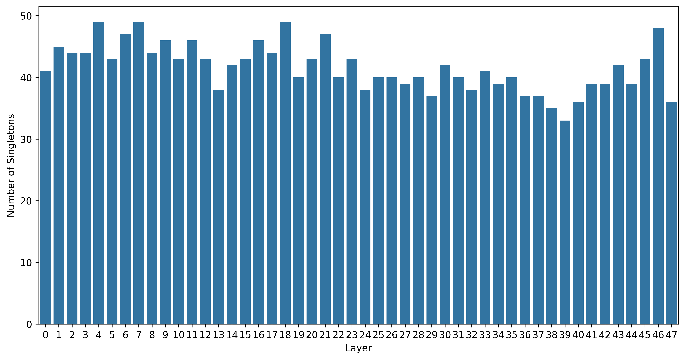

2. **`non_singletons_per_layer.png` (各层合并簇数量 - 冗余度识别)**：
   展示每一层中包含 2 个及以上专家的簇的数量。合并簇数量越多，代表在当前压缩阈值下，REAP 发现了越多具有功能重叠的专家。
   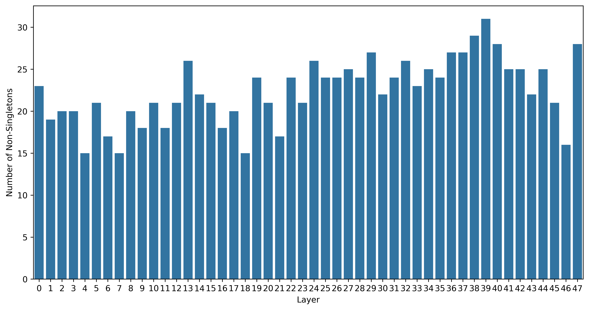

3. **`non_singleton_sizes_per_layer.png` (各层参与合并的专家总数)**：统计每一层中所有属于非单元素簇的专家总数，反映了该层有多少专家处于“可被合并”的状态。
   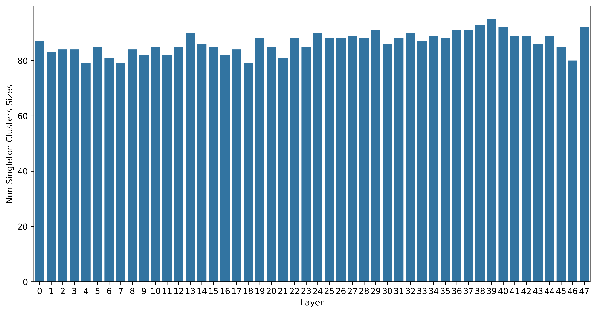

4. **`average_non_singleton_sizes_per_layer.png` (各层平均合并规模)**：每个合并簇平均包含的专家数量。数值越高，说明专家的聚集程度越高，该层的专家冗余度可能越大。
   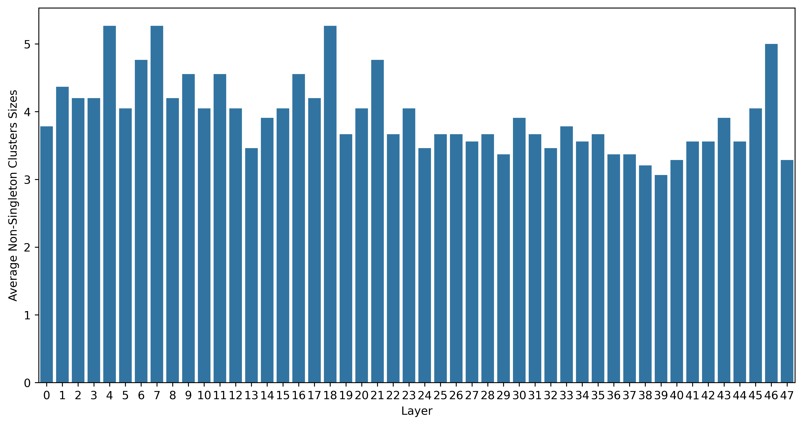

5. **`num_remaining_experts_per_layer.png` (各层最终剩余专家数)**：展示压缩任务完成后，每一层实际保留的专家总数（即 `单元素簇数 + 非单元素簇数`）。
   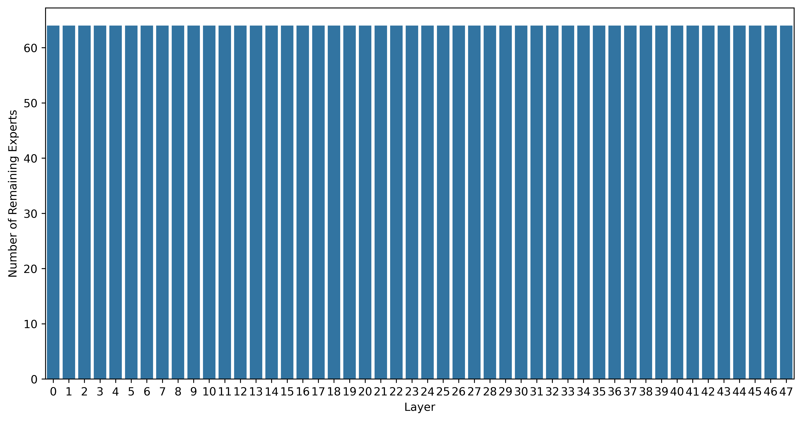

### 详细目录与各层示例说明

除了上述汇总图表外，实验输出目录还包含以下详细数据，用于逐层深入分析：

#### (1) `activation_distributions/` 目录 (显著性度量)

存储各层专家针对不同数据源（如 `all`, `ASR`, `TTS` 等）的**激活频率分布图** (`layer_{n}_activation.png`)。
这些图表展示了 REAP 收集到的原始激活频率指标。REAP 认为激活频率（Expert Frequency）越高，专家对模型能力的贡献越大。分布图说明 Qwen3-Omni 模型专家存在高度跨任务共享性，不宜激进剪枝，而应聚类合并。

**各层激活分布示例 (Layer 0, 24, 47)：**
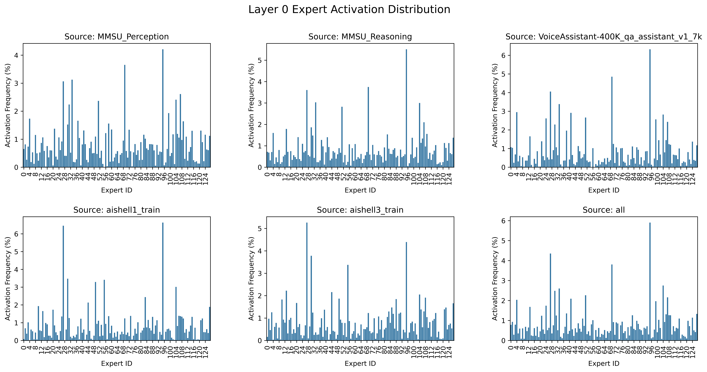
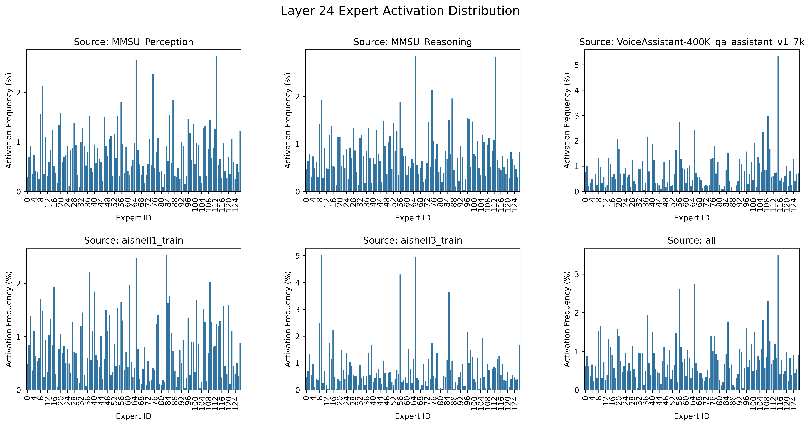
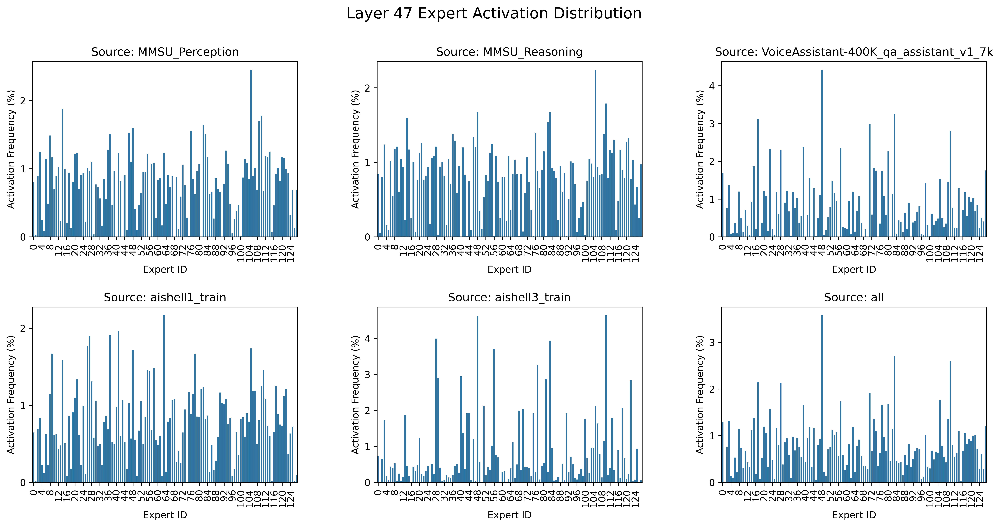

#### (2) `layers/` 目录 (功能重叠验证)

存储各层**聚类簇大小（Cluster Size）的分布图** (`layer_{n}.png`)。聚类过程深度利用了 REAP 观察到的专家激活特征向量或 TTM (Token-to-Model) 相似度矩阵。直观展示特定层中专家的聚合程度。如果某个簇的高度（Size）很大，说明在该层中 REAP 识别到了大量功能极度相似的专家，合并这些专家是安全的。

**各层聚类簇分布示例 (Layer 0, 24, 47)：**
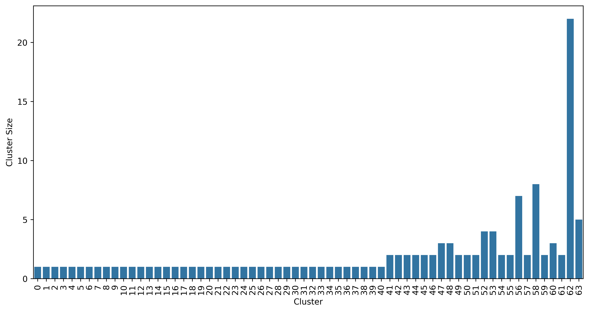
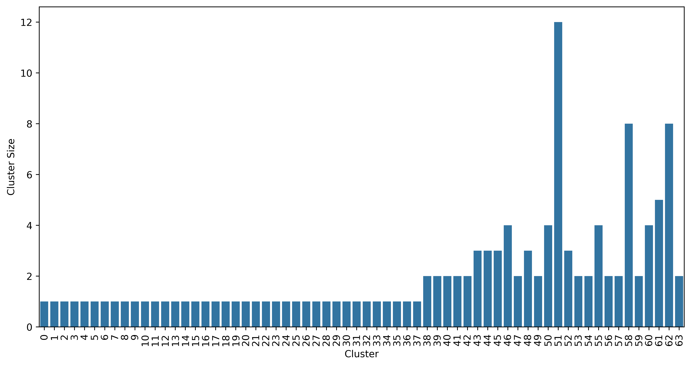
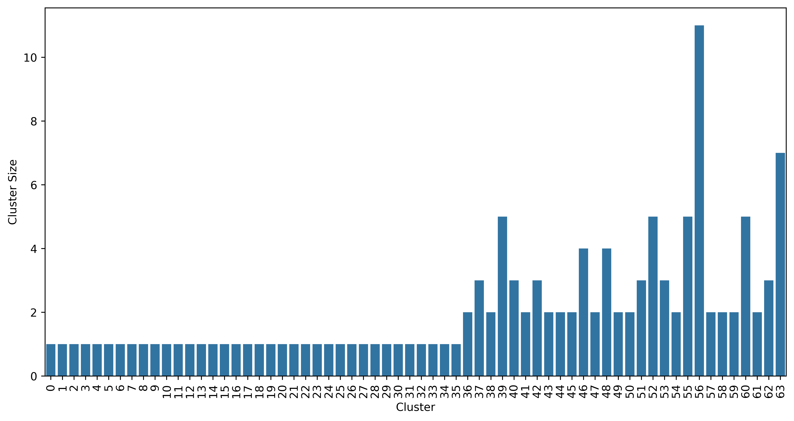

#### （3. `expert_activations.xlsx` (专家激活量化分析)

基于 `expert_activations.xlsx` 中记录的专家激活频率（涵盖 48 层，每层 128 个专家），量化分析结论如下：

* **层级激活分布差异**：高、中、低层的专家激活概率方差极度接近 (0.23 ~ 0.27)。 达到 80% 累积激活概率平均需要约 75-77 个专家，不存在极端主导的专家（最高激活在 6% 左右），且随层增加，不同专家激活更加平均。
* **任务特异性较低**：不同数据源与全局 `all` 的激活差异极小 (1% ~ 3%)。Omni 模型的多模态能力表征是高度交织的。
* **剪枝可行性结论**：不适合过于激进的硬剪枝。鉴于 Omni 模型专家的高度跨任务共享性，在使用 `prune.py` 时应保持保守的压缩率（如 0.2-0.3）。若需大幅压缩模型，**专家融合**是更优选的策略。
